# Veggie Berlin Food Blog

# CONTACT

Hi, I am Aina, a web developer specialized in the front-end. Welcome to my Github and thank you for taking the time to read through the documentation!

As always don't forget yoou can check my [portfolio](https://ainaperez.com/).
You can also contact me through my [Linkedin](https://www.linkedin.com/in/ainaperezserra/)

# INTRODUCTION

## Definition of the website

The website is a blog dedicated to the best vegetarian or vegan restaurants and cafes in Berlin.

The contents of the website, including text and images are of own creation, in order to avoid copyright infringements.

The project is initially done with HTML, CSS and Javascript. There were three phases:

1. PHASE ONE: Initial website build
2. PHASE TWO: Improvement of the website with image direction and advanced elements like canvas and animations.
3. PHASE THREE Performance analysis and improvements

**Note 2022:** In the first quarter of the year I am planning to improve it with real backend and databases either with NodeJS or a PHP framework. The website has still a lot to improve but I am taking it as a long-term project where I can keep incorporating all new thing I learn.

**Note 2022:** This was one of my first websites in HTML and CSS, so CSS styling is not very well formatted. There’s no usage of style guides. Also, a mix of ids and classes has been used to style elements, which is not ideal. Could improve greatly which I am planning to do in the upcoming months. Maybe with the usage of SASS, Bootstrap or Tailwind as well.

Initial web designs were created in [Figma](https://www.figma.com/file/hh267YXNDnsovQOkzcj8bt/web-design?node-id=0%3A1)

## Dependencies used

The dependencies used in this project are:

- Parcel: Build tool used to compilate all files in the build stage. Also provides a built in development server.
- [Autoprefixer](https://github.com/postcss/autoprefixer): PostCSS plugin that parses the CSS and adds vendor prefixers automatically. It is configured in the `.browserslistrc` file. The plugin targets the last 4 versions of the browsers with a market search superior to 0,2%. It excludes those browsers without official support in the last 24 months. It includes IE 11.
- Imagemin: minifies images seamlessly. Useful in this website as there are a lot of images.
- Eslint: Analyses our code for errors. In this case, it is arranged with the standard configuration. Check further configurations in the `.eslintrc.json` file.
- Rimraf: cleans the installed node package.

**Note 2022:** The package Stylelint has been included to organize the CSS.

## Scripts

To help run the website there are some scripts available. They are run thanks to the npm-run-all CLI tool.

- **dev:** starts development server
- **build:** compiles the project into the build folder
- **lint:** runs eslint in all files
- **clean:** cleans cache and the dist folder.
- **stylelint:** following the addition of Stylelint, this script has been created to check for errors in CSS and SASS files and fix them automatically.

---

# ESTRUCTURE OF THE WEBSITE

The web consists of 5 main pages, which appear in the main navigation, and an article page as an example.
The main pages are located inside the src folder, while the individual detail page of the article was separated into another folder called "articles". There could be many more pages of articles in the future, so it has been decided that it would be better to separate them into another section.

**Note 2022**: This will change as I am planning to incorporate backend.

The 5 main pages are as follows:

1. **Index.html:** Home page.
2. **byCategory.html:** page where all the articles are located, which can be filtered depending
   of the food category.
3. **byNeighborhood:** Extra category page to exemplify how articles might also be broken down by neighborhood.
4. **AboutUs.html:** A page where the web page is explained in more detail.
5. **links.html:** page where the copyright links would appear.

The article detail page is called **brammibals.html**.

---

# DETAILING THE HTML

All pages have one thing in common:

1. Head.

   FIRST PHASE: Includes meta tags in the head specifying author, page description, and viewport. The title is also specified. The stylesheet is then linked and the Nunito and Nunito Sans fonts are imported from Google Fonts. Finally, the Javascript file has been linked.

   SECOND PHASE: To expand the project, it has been decided to add a Favicon to the web. To do this, I used the [Favicon website](https://favicon.io), which created the Favicon through an image and provided the html code that had to be added to the head of all pages.

2. Header
   The header includes the web logo on the left side and then a div with an unordered list to form the menu. Also included in this div is a Burger menu, which has been styled via CSS to create the icon to open the menu on small screens. At first, however, the Burger menu does not appear.

   SECOND PHASE: As a major change, the format of the logo file has been changed from PNG to SVG. It has been found to be more convenient, as it is the format commonly used in logos and allows the design to adapt to different screens without losing quality.
   Also, the file size has been reduced from 27KB to 10KB for the main logo, and from 19KB to 9KB for the footer logo.

3. Footer
   The footer consists of three divs. The first contains links to the Imprint page and the privacy policy and copyright text. As with many other links, these do not lead anywhere, as the pages do not exist.
   The second div includes the website logo and social media links.
   Finally, there is a small form to enter the Newsletter. As it is not a real form, no validation has been included for now, aside from the basic one.

## Index.html

The home page begins with a full screen image with the web title and a small caption. The image was not included in the html but was added to the div which encompasses the two titles as a background-image in CSS. This was done because the image was to be fixed when scrolling.

The rest of the page is divided into two span sections of identical structure. These sections are intended to point to the byCategory.html and byNeighborhood.html pages, with the buttons. There are also three div elements in each section, which represent teasers from different categories or neighbourhoods. As you can see, in each teaser there is a "Read more" link that would link directly to the category or neighbourhood page, but they have not yet been linked because these more specific pages do not exist.

**PHASE TWO:**
First of all, a light art direction has been added to the cover of the photo of the hero, as the main element of the photo, in this case the food, was not well appreciated in the mobile version. To make it look better, a copy of the image was created and cropped and applied as a background image to the media query.

To create the clip-art resource, an image has been added to the Brandenburg page announcing future walking tours of the city of Berlin. With the id `brandenburg_clip`, the image has been stylized via CSS. In the CSS file, a clip-path has been applied to the image, in the shape of a polygon, creating a pin-like shape on a map.

The section has also been supplemented with two groups of animated dots. To do this, create two divs with the `road_map` class, one before the image and one after. Within each div and there is a second div containing four divs, corresponding to the four points. CSS was used to create the points. The `point` class of each div has been used to create the aesthetics of the dot, while the individual ids correspond to the delays in the animation.

To create the dot animation, a `@keyframes` named charging has been created, which changes the colour of the dots from white to black, to create the effect of being charging. This animation has been linked to the point class via the `animation-name` property. 1.5 seconds and an infinite count have been applied so that the animation does not stop. Also, the alternate direction causes the animation to go from 0 to 100 and then the other way around to make it smoother.

Finally, at each individual point, a delay of 0.25 seconds was added via the id with respect to the previous point. It is important that the sum of all the delays does not exceed the total duration of the animation because otherwise it would not look good.

## byCategory.html

This page would be where users could find all the articles and filter them by category. This page and the byNeighbourhood page may later come together in a central page with several category or location filters, but for now they would be separate.
The page has two main sections. First there are the filter buttons. These buttons work with JavaScript through the `filterSelection()` function.
The second section is the set of articles. Each article is represented by a teaser containing an image, a paragraph with the name of the neighbourhood, and the title of the article. Each teaser is encapsulated in a div with `content_filter` classes and food category, so they can work with JavaScript.

**PHASE TWO:**
The detail image, as seen in the previous practice, can already be seen in each thumbnail of each post (the next section explains the choice of this image).
To expand the design, however, we wanted to add a small icon to those thumbnails of completely vegan posts.

An example is the first post of Brammibal’s’ donuts. To achieve this goal, a div has been created within the `blog_teaser` div, with the `vegan_container` class. In this div, after the image of the post, the image of the vegan icon has been added.
Then it was styled with CSS. To keep the icon on the top right of the image, the position of the div `vegan_container` has been changed to relative.
An absolute position with an index z of 1 was then applied to the icon to be placed above the image. Finally with the top and right properties it is finished.
The size of the icon has been fixed on the big screens because you want to keep the size small. On small screens, however, as the layout of the thumbnails changes and becomes larger as they take up the entire screen, a width of 40vh has been applied to fit the screen size.

## byNeighbourhood.html

This page contains only teasers for the rest of the category pages in each neighborhood. The structure is almost the same as on the previous page, without the filter buttons. Each neighbourhood is represented by its teaser, which includes the image, the title, a short description paragraph, and the link to the corresponding page, which is currently out of place.

## aboutUs.html

This page corresponds to the presentation page of the practice announcement. The page includes a picture and some paragraphs of text.

**PHASE TWO:** 5 animations were created with SVG and CSS elements.

To create the 5 circles, first I added the SVG tag with the id `svg_circles` and with an auto height to match the height of the main and a width of 100% to take the full width of the screen.

Within the SVG, 5 circles have been created with the tag `<circle>` A different x and y position and a different radius have been applied to each circle to make the different sizes. The sizes are in percentage to be able to make them responsive to the size of the screen. All circles have the same colour, but a different opacity has been applied to them through the style property. Also, except for the first circle, an animation delay has been added so that the animation of the circles starts at different times and looks more dynamic.
CSS has been used as a background, applying an absolute position to SVG with an index 0. In the `<main>`, which has the id ‘canvas’, an index 1 has been applied so that it is on top.
Circles animation has been applied to the circles, causing them to grow large and small intermittently.

Also, to enhance the image on this page, the `<Picture>` tag has been used with two different images depending on the screen size. This was done because the default image looked quite small in the mobile version. At first I only intended to rotate it, but in the end it was also decided to cut it to focus a little more on the main element.

## links.html

The links page is quite short, as the content is own, so there aren't many copyrighted links. Instead, it includes some links to the LinkedIn and GitHub pages.

## brammibals.html

As a detail page, it was decided to create an example article with one of the cafes in Berlin. This page can be accessed through the byCategory page and by clicking on the first result with the photo of the donuts. This page would be a template for the rest of the articles on the web.

To begin with, the title of the article appears.
Then there is a section that includes, on the one hand, a small list with two items: key information about the neighbourhood and whether it’s vegan or vegetarian, and the restaurant’s website.

The text of the article includes paragraphs of text intercalated with images and some tags <strong> to highlight parts of the text.

The images of the articles would have the same vertical and large format and are grouped inside a <figure> tag so that a caption description can be applied.
Finally, a section of related articles will appear on all article pages. This section has been formed through blog teasers such as those that can be seen on the byCategory page. Later, the section could be created with JavaScript.

**PHASE TWO:** The idea is to turn the first photo on the page into the image used for the thumbnails of the posts.
That’s why the featured image in this case doesn’t include art direction. Images would keep the same ratio and direction on both large and small screens and therefore would not change on different screens.

To enlarge the design, however, a modal popup has been included that will act as a zoom of the images.
To create this lightbox effect, a div has been created with the id `myModal` and the class `modal`. A new class has also been added to the 'myImg' image.
The div myModal, includes three spans, with html codes corresponding to the icons of the cross, the arrow on the right and the arrow on the left. Now only the cross is active because I wanted to try to make a lightbox as a gallery that goes through all the images on the blog. After trying several codes in Javascript, it still couldn't be achieved, so it will be left as an example for the first image and in the future I will try to develop more.

It also includes the image with the class `modal_content` and the id = `img01`, which with Javascript will make the clicked image appear inside the lightbox.

The modal has been stylized with CSS through the .modal class. By default it has a display of none, which with Javascript, will become a block when the image is clicked. It also has a z-index of 1 to appear in front of the elements.
The image has been stylized using the `modal_content` class, so that it appears in the center of the lightbox. An openZoom animation has also been applied to make it bigger.

The interaction was created via Javascript.

The function starts by taking the different elements to use and saving them in variables.
The constant img, is where the image to be enlarged is ‘saved’. An `EventListener` has been added, which detects when the image is clicked. When the image is clicked, the modal changes from `display: none` to `display: block` and the `modalImg` statement (where the modal `` tag is stored, takes the image of the same img constant as src.

To close the modal, the cross of the modal has been taken with the class `close_modal` and saved in the constant span. When span is clicked, the modal display becomes none.

---

# DETAILING THE CSS

To begin with, basic colours have been defined that will be present throughout the web, in the form of variables. This will make it easier to change them if necessary. The default margins and padding on all elements of the document have also been removed to begin with a "blank canvas".

The document is then divided into three main sections:

- **General styles:** Includes general text styles
- **Section styles:** Includes common section styles on all pages, ie the header and footer.
- **Page styles:** encompasses the specific styles of the elements on each page.

## General styles

The main source in all texts is Nunito Sans, with sans-serif as the default.
The font size is only defined in the h1 and h2 titles, as the default in the paragraphs, 16px, is the one you want on all devices.
A `.title_pad` class has been applied to most h1 titles. Instead of applying it to h1s in general, there are some h1 titles where you don't want padding.
The hover status has also been applied to the links, plus a hover status to the images in the links to make them more visible.

## Section Styles

To begin with, a 100vh height has been applied to ensure that it takes up the entire screen. A general black colour has also been applied to the text.

A wrapper class has been defined to create side padding on the body.
The header has been defined with a flex display so that the logo and navigation menu are side by side.

Different levels of CSS selectors have been used to define each item to style the menu.

An .active class has been defined, which appears in the active link on each page, with a black underline to more clearly indicate to the user where it is at any given time.

The `.burger_icon` class stylizes the menu for mobile devices. At first the display is none so that it does not appear on the default web page. A media query was created later. Also, each div in the class has been styled as a black line to draw the icon.

The footer has a grid format with three columns.

Two classes, left and center, have been created to align some of the elements. These classes have been used later in some of the other pages as well.

The form has also been styled in the form of a grid. In this case, each item has been individually styled with the corresponding IDs to take on different columns, as the second input and the button were to be in the same row.
The font has also been applied to the inputs to override the defaults that come with browsers.

## Page Styles

### Index.html

The first element of the main page is the large banner, which is defined with a permanent height of 500px. The background image has been set with a fixed attachment so that it does not move when scrolling.

A larger font size has been defined for the title and, like the subtitle, has been capitalized.

The `.black_title` class was created to stylize the text below the hero.

The two span sections have been converted into flexboxes, while the teaser group has been converted into three-column grids. Each individual element is shaped like a "card" with the `.card_teaser` class. This class will be used on other pages where teasers also appear.
The images of the thistles have been included in some divs. These divs act as frames, so that then all the images are cropped and have the same height and width.

The links to the `.readmore` class have also been stylized to be underlined.

The `.button_more` class stylizes the two buttons at the end of the spans.

### ByCategories.html

First, the button section is stylized. The buttons have a hover status and an active class.

The page layout is created in the form of a flex, with a wrap to fit the number of items in each row to fit the screen size. This is because it is understood that more articles will be added in the future and therefore it is not possible to rely on a fixed structure such as a grid.

The teasers on this page do not take the `.card_teaser` class, as on the main page, but they do get a new `.blog_teaser` class, as they are not teasers of web pages but of articles and the style changes a bit.

All teasers also receive a `.content_filter` class, which removes them from the page by default. This is because after JavaScript, a `.show` class is applied to them which makes them appear on the page.

### byNeighbourhood.html

Only the grid layout of the teasers has been distilled on this page. I didn't want to use a flex, because I won’t have to add any more teasers in the future, so the structure is fixed.
The teasers are already stylized by the `.card_teaser` class on the main page.

### brammibals.html

The items are narrower in width and centred.

The div with the short list and the website of the restaurants is stylized through the class `.intro_posts`, in the form of a flexbox.

All images in the articles have a higher margin to separate them slightly from the text. They are also cut in height, but they are all intended to be the width of the article.
The captions will also appear in the centre and with a smaller, thinner italic font to differentiate them from normal text.

The double photo at the end is in the shape of a flexbox.
The related articles section is also a flexbox, but with an auto overflow and a white space nowrap to create a horizontal scroll.

The h3 titles in the teasers have been given a normal white-space so that they do not overlap.

## Media queries

A media query with a cut-off point of 768px has been created to style mobile devices.
The first item to change was the main navigation menu. In this case the burger icon is used to hide the menu. The main menu has been styled to appear on the right side of the device, in the form of a column and with a white background. Also, it won't show up on the page by default, as it has a 105% `translate` to move it to the right of the screen and can't be viewed. Thanks to the `overflow: hidden` that has been previously applied to the body, users cannot scroll horizontally and view the menu by mistake.

In the `.burger_icon` class, a `display: block` has been applied so that the burger icon, which did not appear before, can now be displayed on the screen.
A `.nav-active` class has been created which, thanks to Javascript, will be applied to the `#ul-nav` menu when the burger icon is clicked and will scroll the menu to the left to make it visible on the screen.

In the footer, all items will now appear in a column.

On the index page, the grid of teasers will have only one column so that they appear below each other.
It will be the same for the page by Neighborhoods.

As it appeared in the related articles section of the article page, overflow: auto and white-space: nowrap have been applied to the filter buttons on the byCategory page, so that they appear side-scrolling.

This way the layout will change from a flexbox to a block so that the teasers appear one below the other.
The individual pages of the article will have a wider body, so they can make the most of the screen. Also the introduction of the post will now appear in the column, as will the double photos at the end.

---

# DETAILING THE JAVASCRIPT

The JavaScript document has two main functions.

First up is the function for the burger menu on mobile devices.

The `onClick` attribute has been added to the burger icon, so that every time you click it, the `applyBurgerMenu ()` function of the JavaScript file is executed.
The function takes the div # ul-nav and sees if its class is `.nav_bar`. If the class is nav-bar it will add the class `nav_active` and make the menu appear on the screen. However, if the class is already `nav_bar nav_active` it will transform it so that it is only `nav_bar` so that the menu is hidden again.

**Note 2020:** This function has been changed to use `addEventListener` instead of the `onClick` attribute, as it is a much better practice.

The second function of the document is to control the filter buttons on the byCategory.html page.

First there is the `window.onload`, which will run the `filterSelection` function with the "all" parameter, which will make the "show all" button selected by default and therefore all articles appear on the page.

Inside the `window.onload` is also the for loop that allows you to change the style of the buttons depending on whether they are clicked or not. It has been introduced into the onload because the whole page needs to be loaded in order to run this for loop.

Second is the `filterSelection` function, which will run every time one of the buttons is clicked.
The function will take all the articles through the `content_filter` class, which have all the teasers applied.

You will first see if the show all button is selected.

It will then go through each item in the x-array and remove the "show" class that everyone has applied by default if the "show all" button is clicked. It will do this through the `removeClass ()` function, which accepts element (ie each article) and name (class name, in this case “show”) as parameters.

The `removeClass` function takes the classes of the elements and converts them all into character arrays, eliminating spaces.

It also takes the name (the "show" class) and also converts it into an array of characters. Then through the forum look inside arr1 for those characters that are the same as the arr2 characters and delete them, so that the "show" class of the articles is removed.
The next step in the `filterSelection` function is to check if the article in question contains the class that was defined by clicking the button. For example, in the case of the Chinese button, the function will check if the "chinese" class is in the article through:
`if (x [i] .className.indexOf (c)> -1)`

Because if the class index is found in the article, it will be greater than -1. If the article contains the Chinese class, the `addClass` function will be executed, which will add the "show" class to the article so that it appears on the page.

**Note 2022:** the `window.onload` property has been eliminated. It is not a good practice as it can only be instantiated once. It has been substituted with the `window.addEventListener` method.

---

# FINAL REQUIREMENTS

An online tool has been used to assess web accessibility. There were two main bugs.
On the one hand, the hero's contrast with the text was not enough. This has been fixed by applying a darker overlay to the image, through a linear-gradient, so that the white text takes on more contrast.

Finally, there was a recurring bug across the web. This was the justification for the texts.
Yes, the default text is justified, but it was not considered appropriate to change it, as it was all short sentences or two-line text. However, it has been changed to pages with more text. This created a `no_justify` class that was applied to the longest paragraphs so that the text is on the left.

---

---

---

# PHASE THREE : PERFORMANCE ANALYSIS AND IMPORVEMENTS

## Initial Diagnostic Table

| Title                     | Index.html | byCategory | By Neighborhood | About us | Links  |
| ------------------------- | ---------- | ---------- | --------------- | -------- | ------ |
| Load Time (no throttling) | 7.84s      | 9.56s      | 9.73s           | 5.98s    | 1.01s  |
| Load Time (fast 3G)       | 2.5min     | 2.9min     | 2.3min          | 17.85s   | 2.5s   |
| Total weight              | 30.5MB     | 32.2MB     | 26.1MB          | 2.9MB    | 99.1KB |
| Transferred weight        | 30.5MB     | 32.1MB     | 26.0MB          | 2.9MB    | 51.4KB |
| Amount of resources       | 22         | 23         | 20              | 15       | 14     |

The practice was started with an analysis of the loading times of all pages.
This analysis was done with variable dues, first calculating the average load time without throttling and later in an environment with fast 3G. There was no option to calculate it with 2G and the load time with slow 3G was very high. Measurements have been taken for each page 7 times and the two most extreme values have been deleted thus obtaining the average that appears in the table.

As can be seen, the load times are extremely high. Even with the throttling-free load, more than 3seconds are exceeded.
Likewise, the pages have a very high total weight, especially in those with many images.

An analysis was then conducted with Lighthouse for each page for more information. For each page, you can find the analysis in Desktop (left) and the analysis in mobile (right):

## Capture PSI score and proposals for improvement

### Index.html

Illustration 1. First diagnosis of the Index page.html(Left: desktop. Right: Mobile)

<figure> 
    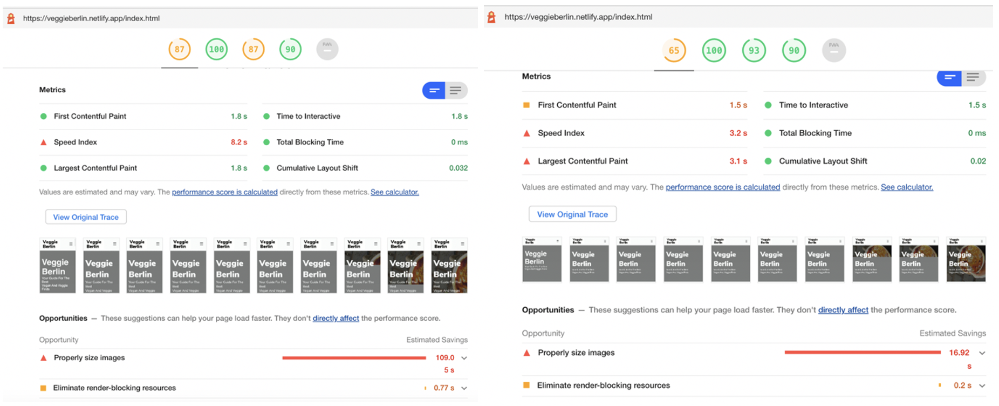
    <figcaption>Illustration 1. First diagnosis of the Index page.html(Left: desktop.  Right: Mobile)</figcaption>
</figure>

The performance of the home page is within the middle threshold, although in the mobile version much more room for improvement is detected. Charging speed is one of the negative metrics.

In opportunities, it can be seen that one of the main problems is the size of the images.
Accessibility is perfect, although there is a small margin to improve best practices. However, SEO is quite high.

### byCategory.html

<figure> 
    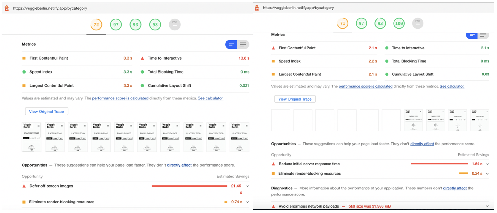
    <figcaption>Illustration 2. First diagnosis of the bycategory page.html(Left: desktop.  Right: Mobile)</figcaption>
</figure>

The By Categories page has a fairly similar analysis in both versions. As on the previous page, the main problem is the weight of the images. In the case of mobile phones, it is observed that the time between the request and the display of the first element on the page is 2.1s, very high for mobile versions.

### byNeighbourhood.html

<figure> 
    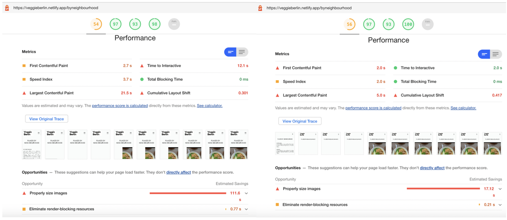
    <figcaption>Illustration 3.  First diagnosis of the byneighbourhood page.html(Left: desktop.  Right: Mobile)</figcaption>
</figure>

By Neighborhood has the worst performance of all. Although it is at the middle threshold, the index is very poor. In this case, many more negative metrics are observed, such as time up to interactivity.
As with the previous pages, the main problem is the size of the images.

### aboutus.html

<figure> 
    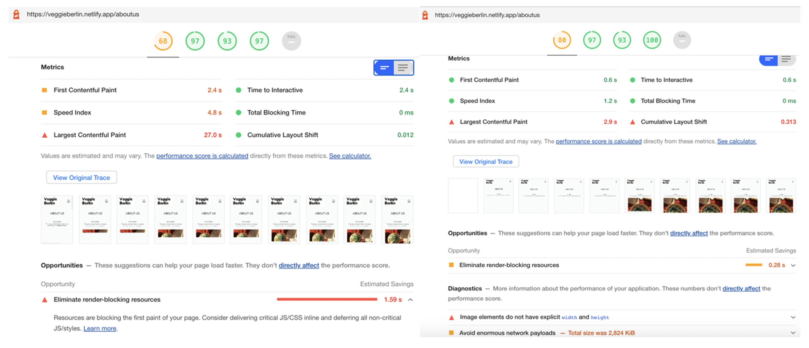
    <figcaption>Illustration 4.  First diagnosis of the aboutus page. html(Left: desktop.  Right: Mobile)</figcaption>
</figure>

In this case, About us is the first page where the performance index is lower in the desktop version than on your mobile.

On this page there is only one image, which removes the main problem from the previous ones. However, the main opportunity lies in removing resources by blocking rendering. This may be due to imported Google sources blocking HTML while loading. This problem is also found in the rest of the pages.

### links.html

<figure> 
    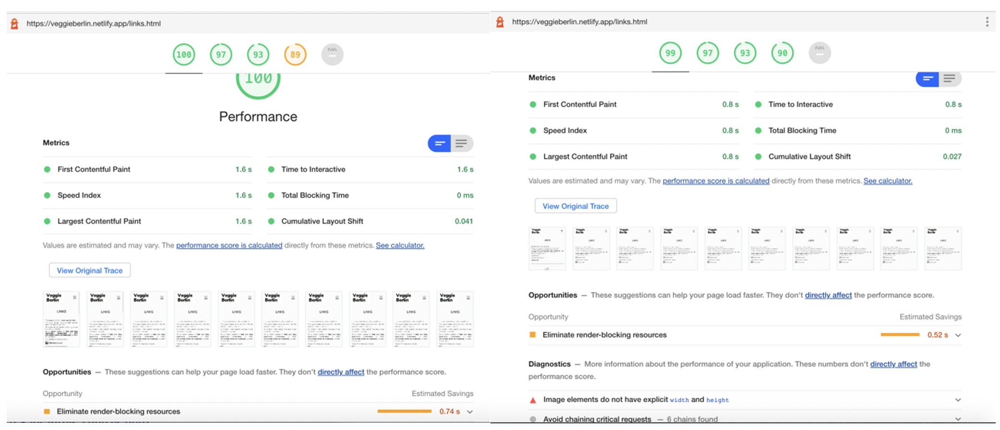
    <figcaption>Illustration 5.  First diagnosis of the links page.html(Left: desktop.  Right: Mobile)</figcaption>
</figure>

As expected, the Links page has an almost perfect performance. This is due to the few resources on the page.

---

## First iteration report

Capture PSI score and proposals for improvement

### index.html

<figure> 
    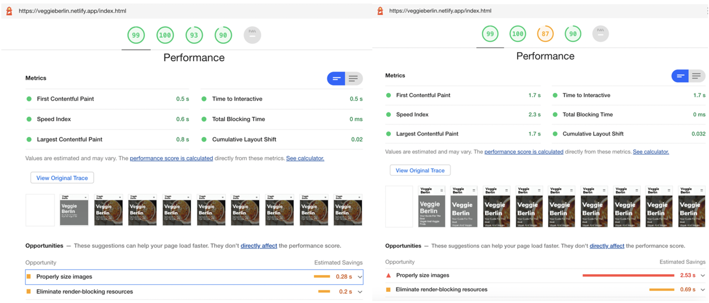
    <figcaption>Illustration 6. First iteration report  on the Index.html(Left: Desktop page.  Right: Mobile)</figcaption>
</figure>

The homepage has received a huge improvement thanks to corrections from a performance index of 87 and 65 in desktop and mobile version, to an astonishing 99 in both cases.

**Proposals for improvement**

<figure> 
    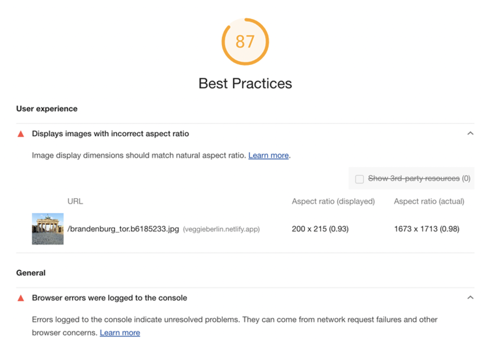
    <figcaption>Illustration 7. Best Practices report on index page.html</figcaption>
</figure>

As opportunities you can still improve the size of any of the images, and it is necessary to correct the resource that blocks the page.
In the case of the mobile version, it is necessary above all to implement some resolution switching strategy to minimize the size of the images more. Also, in the case of Best Practices, there is one of the images that does not have the correct ratio. Also, an error that appears on other pages is the appearance of errors on the console. This is because there is a function that only works with items on the By Categories page, and only errors on the other pages.

### byCategory.html

<figure> 
    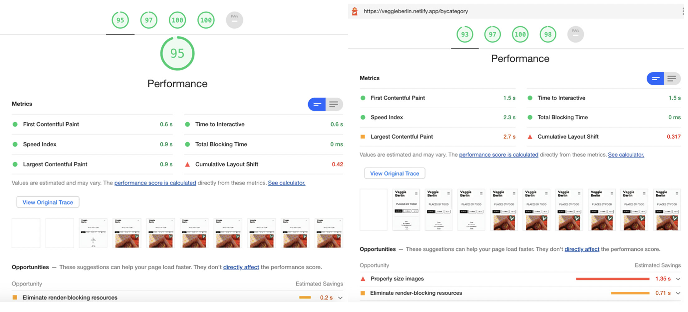
    <figcaption>ustration 8.  First iteration report on the bycategory page.html(Left: desktop.  Right: Mobile)</figcaption>
</figure>

The By Category page has also received an improvement of more than 20 points in the performance index. Likewise, it has finished perfecting Best Practices and SEO.

**Proposals for improvement**

The Cumulative Layout Shift metric should be fixed. Likewise, both the desktop and mobile version have the same opportunities as the inci page.
An SEO error has also been observed that appears on all pages regarding footer links. In the mobile version it would be advisable for them to have more space between them, or become bigger so that they can facilitate the click with their finger.

<figure> 
    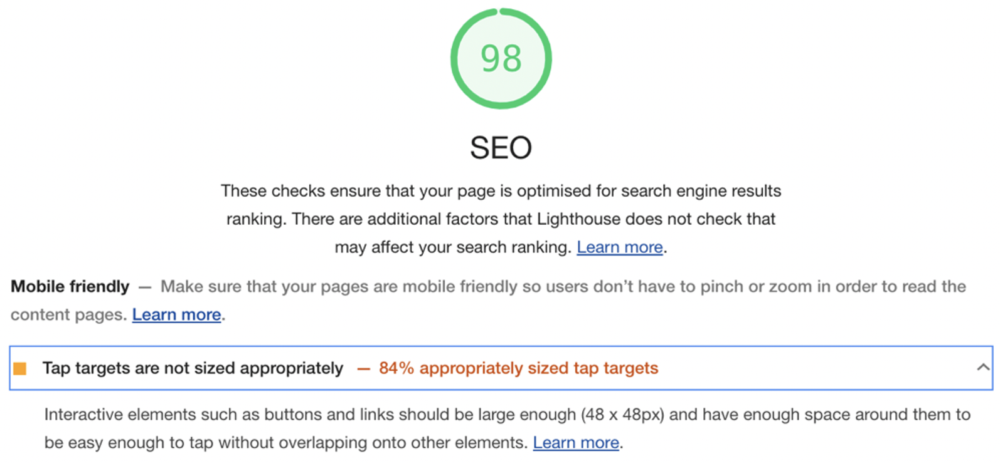
    <figcaption>Illustration 9. SEO error on  bycategory page.html</figcaption>
</figure>

### byNeighbourhood.html

<figure> 
    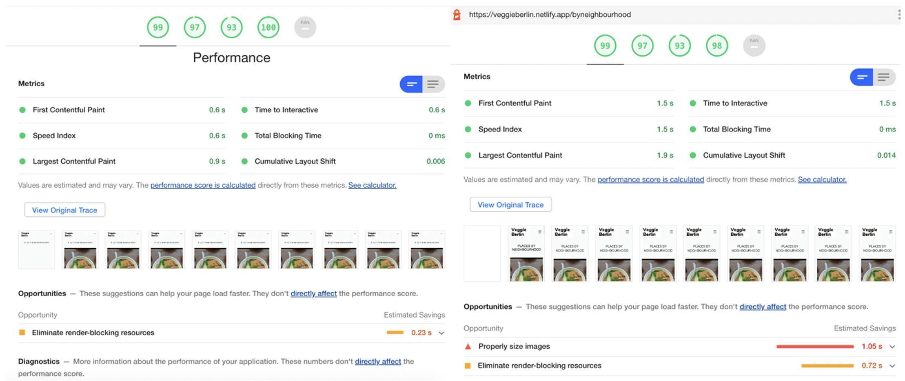
    <figcaption>Illustration 10.  Report of the first iteration of the byneighbourhood page.html(Left: desktop.  Right: Mobile)</figcaption>
</figure>

<figure> 
    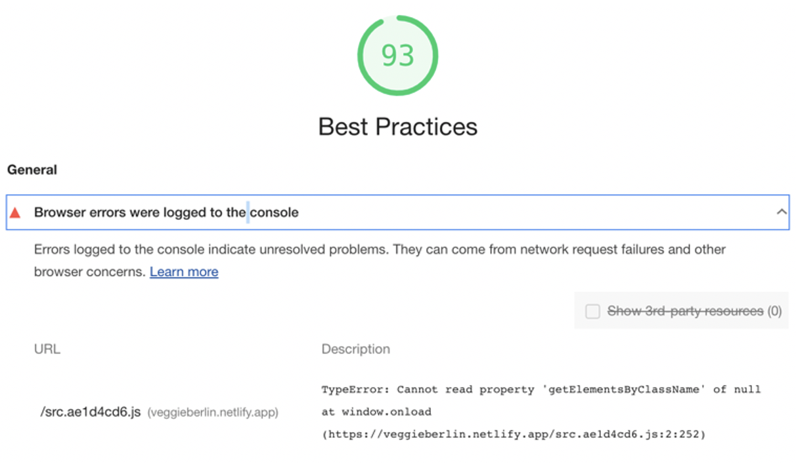
    <figcaption>Illustration 11. Error in  Best Practices section of  byneighbourhood page.html</figcaption>
</figure>

Despite being the page with the worst results at the beginning, with this first iteration has obtained the greatest improvement, going from an average of 50 to almost 99 in performance.

**Propostes for improvement**

As in the previous pages, it is necessary to remove the blocking in the rendering and can improve the management of the images in the mobile version. It also receives the console error.

### about.html

<figure> 
    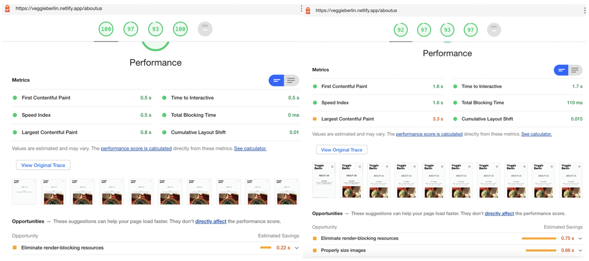
    <figcaption>Illustration 12.  Aboutus page first iteration  report.html(Left: desktop.  Right: Mobile)</figcaption>
</figure>

The About us page, which was also at an average performance level, has improved to get the maximum index. Its main problem, which was the size of the image, has been solved by resizing the original image. Although the size of the image can be further decreased in the mobile version.

### links.html

<figure> 
    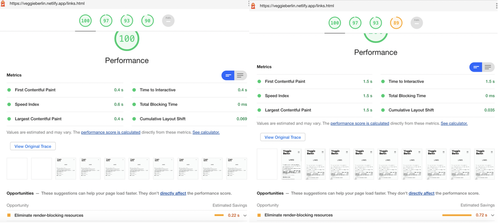
    <figcaption>Illustration 13.  Report of the first iteration of the links page.html(Left: desktop.  Right: Mobile)</figcaption>
</figure>

The links page has not received much improvement, since in the initial analysis it had also obtained many good results.

**Proposals for improvement**

Although there are not many aspects to improve on this page, SEO could be increased if addresses were given to some of the links that do not link anywhere at the moment. Fixing social media links with directions and increasing size should be enough.

<figure> 
    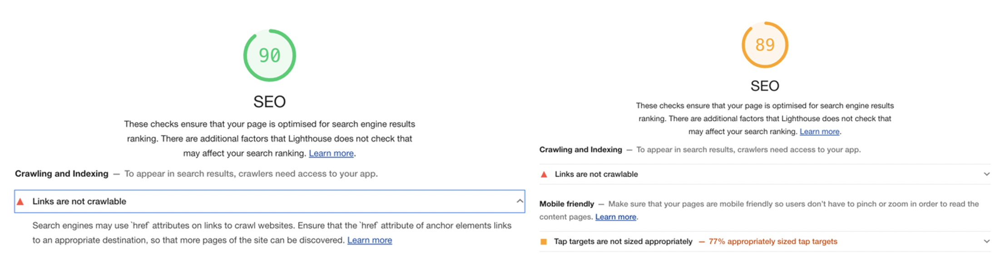
    <figcaption>Illustration 14. SEO errors in the  desktop and mobile version of the  links page.html</figcaption>
</figure>

### brammibals.html

<figure> 
    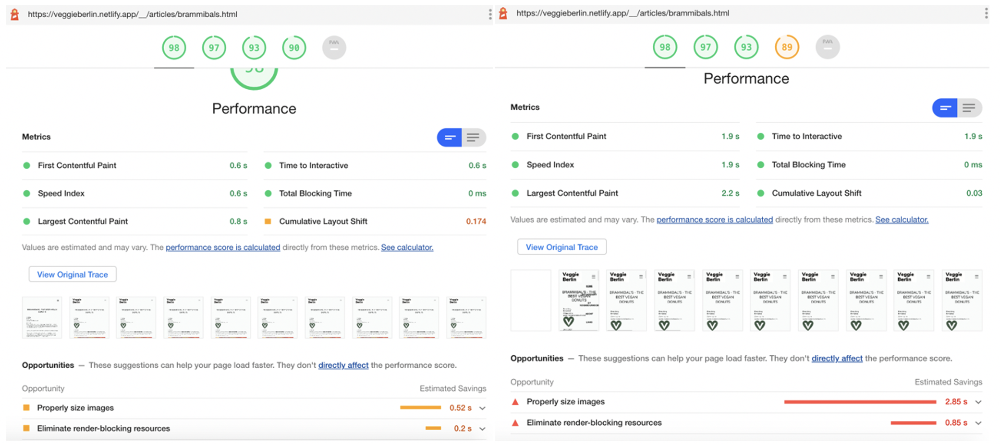
    <figcaption>Illustration 15.  Report of the first iteration of the  brammibals detail page.html(Left: desktop.  Right: Mobile)</figcaption>
</figure>

Unfortunately, I don't have an initial analysis of the detail page, but after the improvement in the photos, it must be said that the analysis in general is positive.

**Proposals for improvement**

As on other pages, photos can be further reduced, especially in the mobile version.
There is also an SEO error in one of the links in the text, which is missing the link.

---

## Analysis of the performance improvements applied to the website

For this first iteration, 3 main changes have been applied that have greatly improved the performance of the web. Another extra change has been fixing the JavaScript code on the By Category page, removing onclick attributes from buttons.
First the loading has been applied to all those images that were outside the initial viewport. Likewise, an asynchronous load has been applied to the JavaScript script.

The big change, however, has been caused by the decrease in the size of the images, which was the main problem on most pages.

To make the decrease, the images were first edited, lowering the size, from the original, to a maximum of 1500px width(or height, depending on the orientation). For large images, such as the hero's at the beginning, it has dropped to 2500px.

Then the Imagemin package has been installed, in order to compress the images even more once the "build" has been done through Netlifly.

With these corrections, the change is big, since the download times have decreased by more than 7 times the initial times, as can be seen in the following table. For 3G loads, times have passed from minutes to seconds. Likewise, the weight of the pages has also fallen a lot, with a maximum of 2.3MB, compared to the 30MB of earlier.

The "Lazy loading" has also improved the upload of the files, since, especially since they are images, they are not all loaded at once and allow the server not to be so saturated. However, it has been possible to observe a better functioning of Loading on Localhost than on Netlifly, as Netlifly initially begins loading some of the images that are not in the viewport.

As can be seen, all desktop pages have very positive metrics, except in some cases of Best Practices that can be solved in the second iteration. In the mobile version, a notable general improvement has also been achieved although the weight of some images is still missing.

Table 2. First Iteration Performance Diagnosis

| Title                              | Index.html   | byCategory | By Neighborhood | About us | Links  | brammibals   |
| ---------------------------------- | ------------ | ---------- | --------------- | -------- | ------ | ------------ |
| Charging time (without throttling) | 1.29s        | 2.8s       | 1.12s           | 1.83s    | 231ms  | 1.26s        |
| Charging time(fast 3G)             | 13.42s/1.40s | 5.5s\*     | 9.64s           | 3.76s    | 2.10s  | 10.55s/8.74s |
| Total weight                       | 2.3MB        | 1.8MB      | 1.5MB           | 384MB    | 81.8KB | 1.7MB        |
| Transferred weight                 | 2.2MB        | 1.8MB      | 1.5MB           | 351MB    | 47.9KB | 1.7MB        |
| Amount of resources                | 22           | 23         | 20              | 15       | 14     | 19           |

### Applying lazy load to images

The main change seen when applying lazy loading is that not all photos were taken at first. Only those photos that were seen on the viewport were uploaded to the network at first, but the rest did not. Once it was downloaded to the page, the requests for the rest of the photos were produced.

This has originally caused the page load to shrink, decreasing its sting, and accelerated the overall load of the page.

<figure> 
    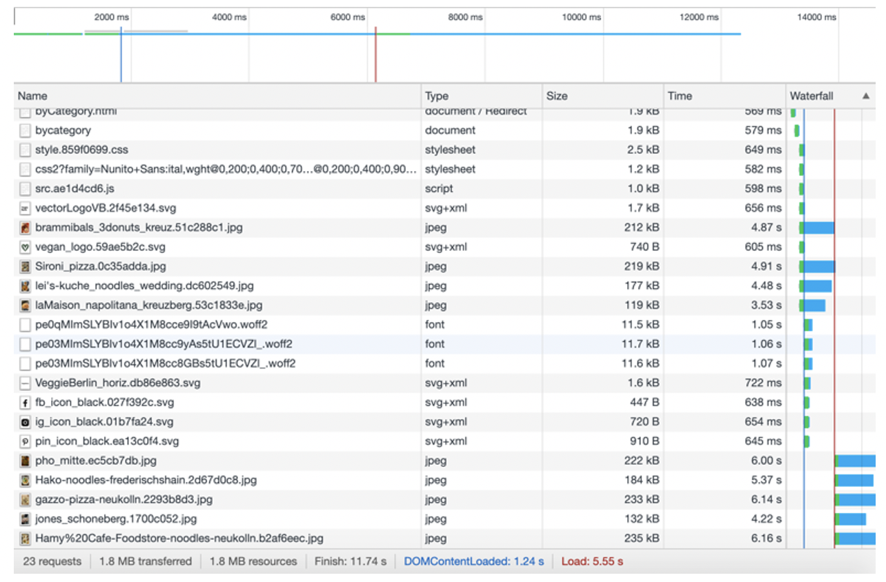
    <figcaption>Illustration 16. Capture of the network on the  index page.html</figcaption>
</figure>

As can be seen in the image, after loading the styles, the page loaded the first images seen in the viewport. Once scrolling has been done, the browser has made the request for the rest of the photos.

### Applying asynchronous load to scripts

In this website , the "defer" method has been used to load the writings asynchronously. Defer load JavaScript once the HTML has finished parsing.

The async method loads the JavaScript asynchronously while the HTML continues to pars. This method, although loading asynchronously, cannot guarantee that JavaScript will finish loading after all HTML has been parsed because it sometimes depends on the Internet connection that one has. There will be times in which JavaScript will finish loading before the HTML has been fully parsed.

One of the main problems that can occur is this, since once the script has been loaded, the HTML parsing will be interrupted to run the script and then continue.
That is why it was deemed more convenient to do so with deferment because it was assured that JavaScript would load the last one and therefore have the necessary html elements loaded before using them in JavaScript, and this would not interfere at the same time in the loading of HTML, which is needed as free as possible to facilitate the loading of images etc.

---

## Second iteration report

Improvements in the score and changes in the report with respect to the first.

Table 3. Performance diagnosis after the second iteration.

| Title                              | Index.html | byCategory | By Neighborhood | About us | Links  | brammibals |
| ---------------------------------- | ---------- | ---------- | --------------- | -------- | ------ | ---------- |
| Charging time (without throttling) | 923ms      | 421ms      | 835ms           | 560ms    | 181ms  | 767ms      |
| Charging time(fast 3G)             | 11.82s     | 5.53s      | 9.62s           | 3.72s    | 2.04s  | 8.12s      |
| Total weight                       | 1.8MB      | 808KB      | 1.5MB           | 380MB    | 77.8KB | 1.3MB      |
| Transferred weight                 | 1.8MB      | 808MB      | 1.5MB           | 350MB    | 47.4KB | 1.2MB      |
| Amount of resources                | 13         | 18         | 14              | 15       | 13     | 18         |

Thanks to the latest corrections and improvements made to CSS and JavaScript images and files, a considerable improvement has been achieved in loading times. Although the average weight has not dropped much since the first iteration (since the biggest change occurred in the first iteration), the load times have been reduced and the number of resources requested in the first instance has also decreased in some pages, due to the lazy loading applied to the first iteration.

The most surprising of all is how in total load times have dropped, especially without throttling, since the averages are less than a second, when at the beginning they exceeded 7 seconds on average.

In the case of 3G loading, although in one of the pages the load is still high, the great decline is seen. An average of 2 1/2 minutes has been reduced to a maximum of 12secons.

## Capture of PSI score and proposals for improvement

### index.html

<figure> 
    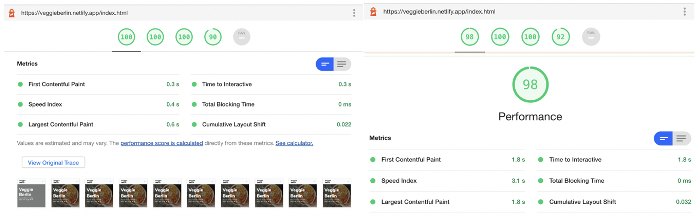
    <figcaption>Illustration 17.  Second  iteration report on index page.html(Left: desktop.  Right: Mobile)</figcaption>
</figure>

The home page has been perfected in both desktop and mobile versions, thanks mainly to the second compression of the images.

### byCategory.html

<figure> 
    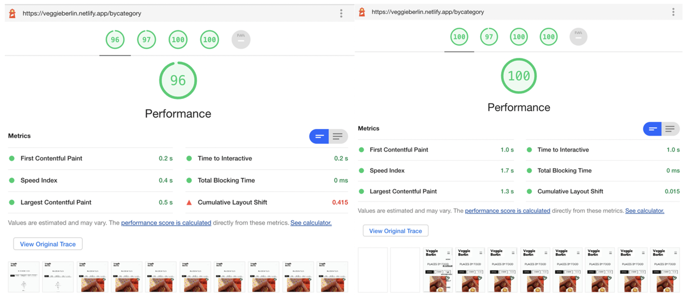
    <figcaption>Illustration 18.  Report of the second iteration of the bycategory page.html(Left: desktop.  Right: Mobile)</figcaption>
</figure>

The By Category page has increased by 1 point in the desktop version performance although the Cumulative Layout Shift continues to cause problems. This indicates that there is still some element that moves during loading. In the case of the mobile version this is not a problem. In accessibility there is a small error with the titles of the blogs, since they are H3 instead of H2 and therefore are not sequential.

### byNeighbourhood.html

<figure> 
    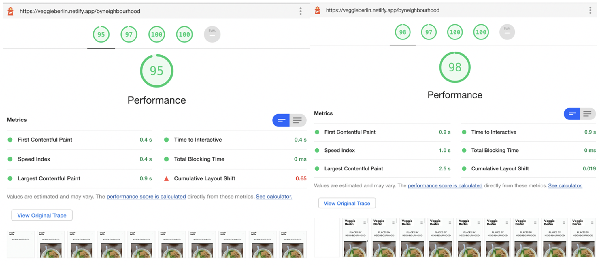
    <figcaption>Illustration 19.  Report of the second iteration of the byneighbourhood page.html(Left: desktop.  Right: Mobile)</figcaption>
</figure>

The By Neighbourhood page has declined in its performance index. Although all the metrics indicated have been fixed, it now also indicates the same problem with the movement of items as on the By Category page.

In the case of the mobile version, the score is almost perfect in all aspects.

### aboutus.html

<figure> 
    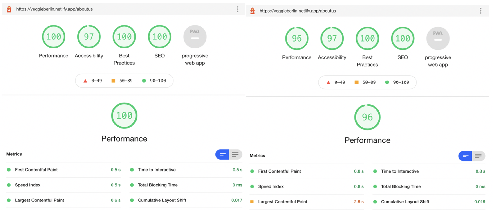
    <figcaption>Illustration 20.  Report of the second iteration of the aboutus page.html(Left: desktop.  Right: Mobile)</figcaption>
</figure>

The About page has received a perfect rating on the desktop version. The remaining three points in accessibility are due to the title of the Newsletter in the footer that is a h4 and does not respect the sequential order.

The difference in performance in the mobile version is due to the fact that Lighthouse is analyzing the photo that appears in the desktop version, instead of the mobile version.

### links.html

<figure> 
    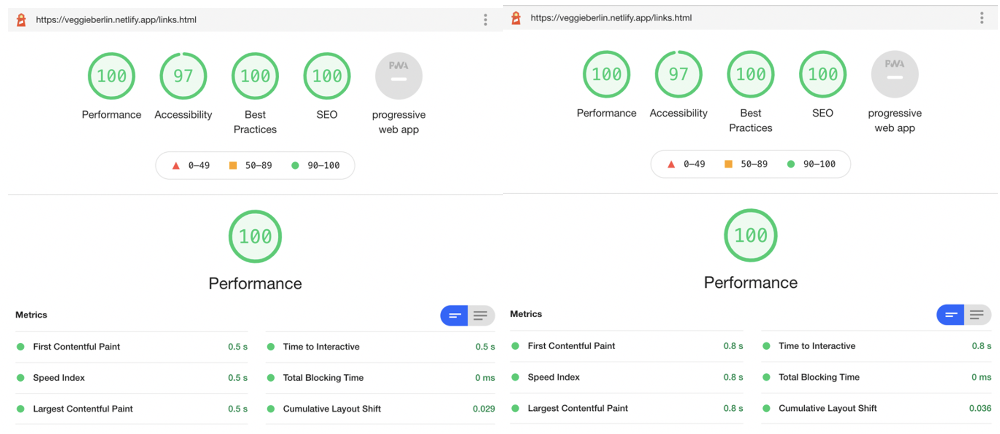
    <figcaption>Illustration 21.  Second iteration report of the links page.html(Left: desktop.  Right: Mobile)</figcaption>
</figure>

The links page has also achieved a perfect score in both the performance and the Best Practices and SEO section. The improvement in the latter has been achieved by fixing the LinkedIn and Github links, which they did not direct anywhere.

### brammibals.html

<figure> 
    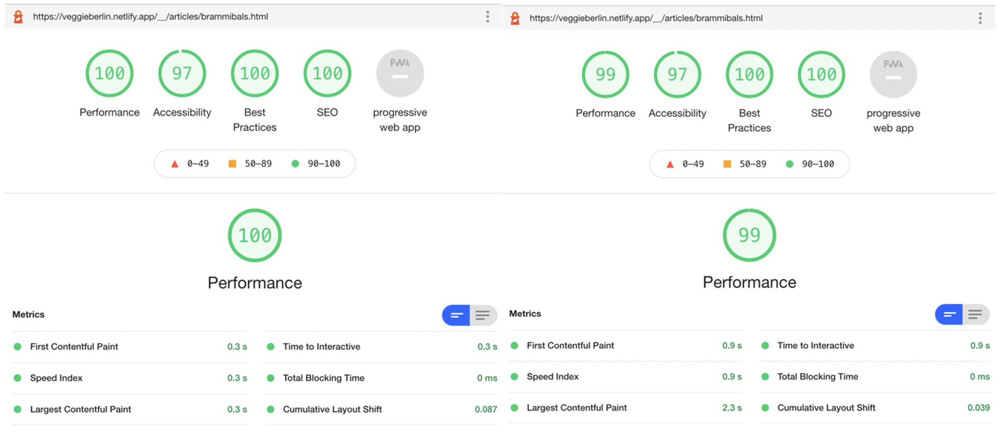
    <figcaption>Illustration 22.  Report of the second iteration of the brammibals page.html(Left: desktop.  Right: Mobile)</figcaption>
</figure>

Finally, the Brammibals detail page has also obtained a perfect performance index. In the mobile version it would be necessary to finish fixing the size of an image. Apart from that, the metrics are perfect.
The decline in accessibility is also because some titles are not in sequential order.

**Proposals for improvement**

In general, the diagnosis has been very positive. Some residual elements remain to be improved.
In order to finish perfecting accessibility, you could try to restructure page titles to maintain sequential order. At first, they had been ordered in this way rather to be able to differentiate styles, but you can try to stylize the different titles more through classes and not through the element itself.
Second, it would be necessary to inspect which items move when the page is loaded in order to remove the error in the Cumulative Layout shift of some pages, especially in the desktop version.
Finally, the only thing that would be missing in the SEO of some pages is due to the lack of href in some of the links, since so far the corresponding pages have not been created.

## Analysis of the performance improvements applied to your website

In this last iteration I applied some small changes that have helped in general to finish perfecting the performance of the website.

The most important change has been the implementation of srcset in most photographs. A cuttlefish of the photos has been created and this cuttlefish has been reduced to adapt it to the size of mobile phones. Thanks to srcset, the browser has been able to choose the images that best suited the mobile phone, thus reduce the load of the screen even more.

Also, the second big change has been the writing of the sources to load within the html of the pages. Although at first it may seem like a lot of code, the inline load of the sources eliminates the rendering block that occurred in the first iteration and that caused one of the main errors in performance analysis.

Likewise, console errors have been removed by creating a separate JavaScript file where the code corresponding to the By Category page has been implemented. This file has only been uploaded to the corresponding page, also with defer asynchrony. This has removed errors from all other pages getting improvements in the Best Practices section.

Another improvement of Best Practices has been the expansion of margins to footer links, which allow to obtain a larger clickable area and therefore facilitates the user experience in the mobile version. Errors corresponding to these links have disappeared.
The About us page also corrected a Best Practices error that gave the SVG chart. The height attribute (auto to 100%) has been corrected in the SVG charts on the About us page.

Finally, three `non-crawable` links on the links and Brammibals page that gave SEO errors have been corrected. On the other hand, LinkedIn and GitHub links have been corrected on the links page.html. A link to the café's Instagram page has been corrected on the Brammibals page.

# Final thoughts

If you have arrived until here, let me thank you for reading through all the documentation, even though it is the longest i've ever done.

The website has still a lot to improve but I am taking it as a long-term project where I can keep incorporating all new thing I learn.

As always don't forget yoou can check my [portfolio](https://ainaperez.com/).
You can also contact me through my [Linkedin](https://www.linkedin.com/in/ainaperezserra/)
